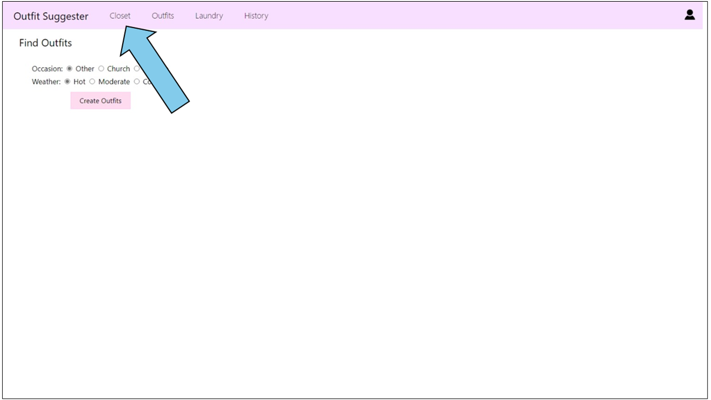

# Outfit Suggester
Outfit Suggester is a three-tier application that suggests outfits from clothes in your wardrobe!
The client is a web app, the server uses Node.js, and it uses an SQLite database. To try out the website,
go to https://outfitsuggester.avajustice.com and follow the [instructions](#tutorial) at the bottom of the README.

## Developer Instructions

### Install Node
On Ubuntu:
```
$ curl -fsSL https://deb.nodesource.com/setup_20.x | sudo -E bash -

$ sudo apt-get install -y nodejs
```

### Install App
```
$ cd src/web
$ npm install
```

### Configure environment variables
Create a `.env` file beside `index.js`. This file contains secrets and install-specific data, so it isn't checked into git. The file should contain the following...

```
OUTFIT_DATA_DIR=/var/lib/outfit-data2
CLIENT_ID={client-id}
ISSUER_BASE_URL=https://{xyz}.auth0.com
SECRET={random-long-string}
PORT=3000
```
The curly braces { } above indicate placeholder values. Don't actually include the braces in your file.

Details:
- `OUTFIT_DATA_DIR` should be the local path where you want to store the app's data.
- `CLIENT_ID` is the Auth0 Client ID value. Get it from the Auth0 dashboard.
- `ISSUER_BASE_URL` is the Auth0 Domain with an https:// prefix. Get the Domain value from the Auth0 dashboard.
- `SECRET` should be a random long string, such as one generated with `openssl rand -hex 32`. This is NOT the same as the Auth 0 Client Secret value.
- `PORT` is the port where the app will run.


### Create data directories
By default, the path is `/var/lib/outfit-data`. If you set a different `OUTFIT_DATA_DIR` value, use that path instead in the commands below.

Ensure the folder and subfolder exist and grant access if needed:
```
$ sudo mkdir /var/lib/outfit-data
$ sudo mkdir /var/lib/outfit-data/images

$ sudo chown USERNAME /var/lib/outfit-data
$ sudo chmod 700 /var/lib/outfit-data

$ sudo chown USERNAME /var/lib/outfit-data/images
$ sudo chmod 700 /var/lib/outfit-data/images
```

### Run server
```
$ cd src/web
$ npm start
```

### Browse site
Go to http://localhost:3000/

## <a name="tutorial"></a>Using the Site
Outfit Suggester is a work in progress, so some aspects of using the site are not self-explanatory yet.
Here is a brief tutorial to demonstrate getting started with Outfit Suggester.

1. Go to https://outfitsuggester.avajustice.com.

2. First, create an account. Click the person icon in the righthand corner, then click the login link to 
make your account.


</br>


3. Now you need to add your clothes to the closet! Click "Closet" at the top of the screen, then click
the "Add Items" button.


</br>


4. For each item you want to add, fill in all the fields with information about that item, then click "Create
Item." Make sure to click "Upload" after you choose your image!


5. Now you can create outfits! Click "Outfits" at the top of the screen, then choose the desired occasion and
weather before clicking "Create Outfits."


6. Click "Wear" to choose the outfit that you want to wear today. Your selection will show up under "History" 
and the clothing items will be marked as unavailable until they are washed.


</br>

</br>


Note: If you want to select individual items to wear, you can choose them in the "Closet" section.

7. After you wash clothes, click on the "Wash Regular" or "Wash Delicates" dials under "Laundry"
to make the items available to wear again.


</br>


</br>
Now you know the basics of using Outfit Suggester. Enjoy exploring outfit choices and making the 
most of your wardrobe!
